# DDL Commands
```sql
create table User(
    user_name varchar(255),
    user_id varchar(50) Primary Key,
    user_password varchar(50)
);
```
```sql
create table Favorite_Query (
    query_id int Primary Key,
    user_id varchar(50),
    period_begin Date,
    period_end Date,
    location_type varchar(5),
    location_value varchar(255),
    property_type_id varchar(50),
    query_type varchar(50),
    visualization_type varchar(50),
    data_type varchar(20),
    Foreign Key (user_id) References User(user_id) ON DELETE CASCADE
);
```
```sql
create table Location(
    region_id int Primary Key,
    region varchar(50),
    city varchar(50),
    us_state varchar(50),
    parent_metro_region varchar(50)
);
```
```sql
create table User_Reporting(
    report_id int Primary Key,
    user_id varchar(50),
    region_id int,
    property_type varchar(50),
    sold_price real,
    list_price real,
    list_time Date,
    sold_time Date,
    square_feet real,
    Foreign Key (user_id) References User(user_id) ON DELETE CASCADE,
    Foreign Key (region_id) References Location(region_id) ON DELETE CASCADE
);
```
```sql
create table Favorites_Report(
    favorite_user_id varchar(50),
    reporting_user_id varchar(50),
    report_id int,
    Primary Key (favorite_user_id, reporting_user_id, report_id),
    Foreign Key (favorite_user_id) References User(user_id) ON DELETE CASCADE,
    Foreign Key (reporting_user_id) References User_Reporting(user_id) ON DELETE CASCADE,
    Foreign Key (report_id) References User_Reporting(report_id) ON DELETE CASCADE
);
```
```sql
create table House(
    property_type_id int,
    period_begin Date,
    region_id int,
    period_end Date,
    property_type varchar(50),
    median_sale_price real,
    median_list_price real,
    median_ppsf real,
    median_list_ppsf real,
    homes_sold int,
    sold_above_list real,
    pending_sales int,
    new_listings int,
    inventory int,
    months_of_supply real,
    median_dom real,
    off_market_in_two_weeks int,
    Primary Key (property_type_id, period_begin, region_id),
    Foreign Key (region_id) References Location(region_id) ON DELETE CASCADE
);
```

# First query
### Find the city, time_period for median_sale_price < 700k for townhouses and <1M for residential in the last 3 years
```SQL
SELECT h.city, h.period_begin, h.period_end
FROM (
    (
    SELECT l2.city, h2.period_begin, h2.period_end
    FROM Location l2 NATURAL JOIN House h2
    WHERE h2.median_sale_price < 700000 AND h2.property_type = 'Townhouse'
    )
UNION
(
    SELECT l3.city, h3.period_begin, h3.period_end
    FROM Location l3 NATURAL JOIN House h3
    WHERE h3.median_sale_price < 1000000 AND h3.property_type = 'Residential'
    
)
) AS h
WHERE h.period_begin < DATE_SUB(CURDATE(), INTERVAL 3 YEAR)
LIMIT 15; 
```
### top 15 rows


### explain analyze without index


### index house_median_sale_price on House(median_sale_price)


### index house_median_sale_price + house_property_type on House(median_sale_price, property_type)


### index house_property_type on House(property_type)


### Conclusion: Indexing House(property_type) can provide best performance among these tests. While indexing House(median_sale_price) worsen the performance. Indexing House(median_sale_price, property_type) also performs better than no index.

# Second query

### Find the city and time period with the highest median price per square foot price in America
```SQL
SELECT House.period_begin, House.period_end, Location.city
FROM House NATURAL JOIN Location
WHERE House.median_ppsf =
    (
        SELECT MAX(h2.median_ppsf)
        FROM House h2
    );
```
### top 15 rows


### explain analyze without index


### index house_median_ppsf on House(median_ppsf)
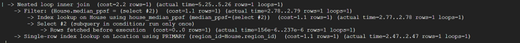

### index location_city on Location(city)
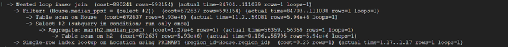

### index house_period_end on House(period_end)
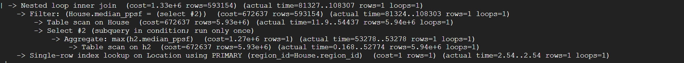

### Conclusion: Indexing House(median_ppsf) can provide best performance among these tests. Indexing Location(city) and House(period_end) also performs better than no index.

# Third query
### Find highest price of house in a metro area over a time span for Townhouse
```SQL
SELECT MAX(House.median_sale_price), Location.parent_metro_region
FROM House NATURAL JOIN Location
WHERE House.property_type = 'Townhouse'
AND House.period_begin >= '2010-01-01' AND House.period_end < '2020-01-01'
GROUP BY Location.parent_metro_region
LIMIT 15;
```
### top 15 rows
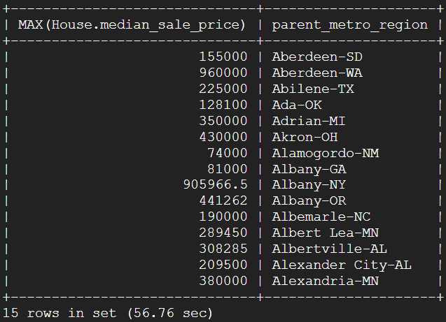

### explain analyze without index
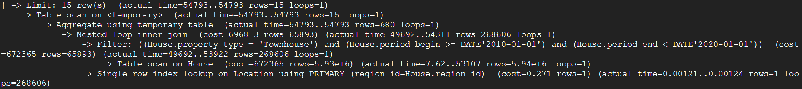

### index house_property_type on House(property_type)
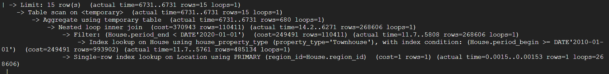

### index location_parent_metro_region on Location(parent_metro_region)
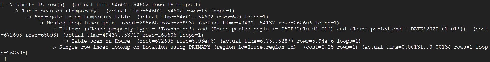

### index house_period_end on House(period_end)
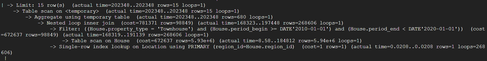

### Conclusion: Indexing House(property_type) can provide best performance among these tests. While indexing House(period_end) worsen the performance. Indexing Location(parent_metro_region) performs slightly better.

# Fourth query
### Find the city in each metropolitan area with the smallest gap between median list price and median sale price in 2024 for Townhouse
```SQL
SELECT L.parent_metro_region, L.city,
       AVG(H.median_list_price - H.median_sale_price) AS avg_price_gap
FROM House H
JOIN Location L ON H.region_id = L.region_id
WHERE H.period_begin >= '2024-01-01' AND H.period_end < '2025-01-01' AND H.property_type = 'Townhouse'
GROUP BY L.parent_metro_region, L.city
ORDER BY avg_price_gap DESC
LIMIT 15;
```
### top 15 rows
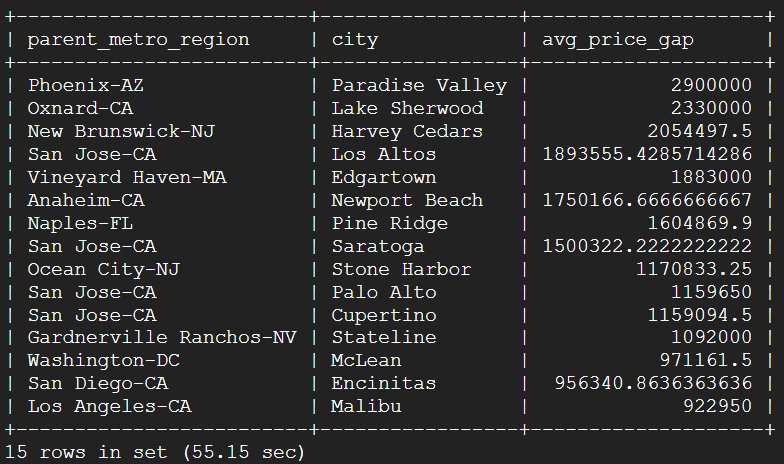

### explain analyze without index
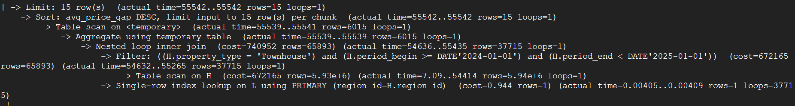

### index location_city on Location(city)
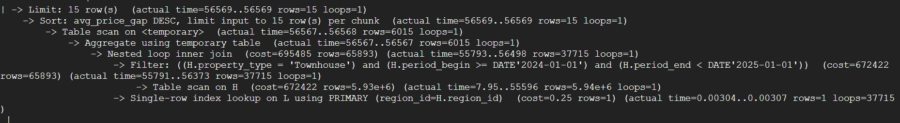

### index house_property_type on House(property_type)
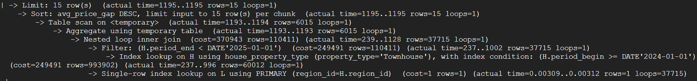

### index location_parent_metro_region on Location(parent_metro_region)
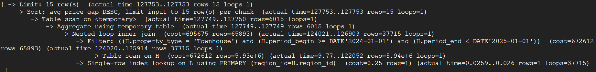

### Conclusion: Indexing House(property_type) can provide best performance among these tests. While indexing Location(city) and Location(parent_metro_region) worsen the performance.

# Final Index Design
### create index house_property_type on House(property_type);
Since first, third, and fourth query got the conclusion that indexing House(property_type) would get best performance.
### create index house_median_ppsf on House(median_ppsf);
Since second query got the conclusion that indexing House(median_ppsf) would get best performance.