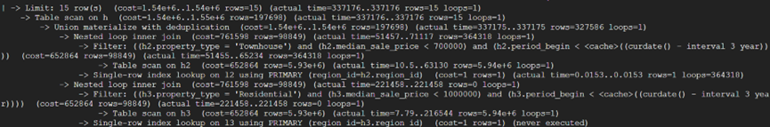

# First query
### Find the city, time_period for median_sale_price < 700k for townhouses and <1M for residential in the last 3 years
```SQL
SELECT h.city, h.period_begin, h.period_end
FROM (
    (
    SELECT l2.city, h2.period_begin, h2.period_end
    FROM Location l2 NATURAL JOIN House h2
    WHERE h2.median_sale_price < 700000 AND h2.property_type = 'Townhouse'
    )
UNION
(
    SELECT l3.city, h3.period_begin, h3.period_end
    FROM Location l3 NATURAL JOIN House h3
    WHERE h3.median_sale_price < 1000000 AND h3.property_type = 'Residential'
    
)
) AS h
WHERE h.period_begin < DATE_SUB(CURDATE(), INTERVAL 3 YEAR)
LIMIT 15; 
```


### explain analyze without index


### index house_median_sale_price


### index house_median_sale_price + house_property_type

### index house_median_sale_price

# Second query

### Find the city and time period with the highest median price per square foot price in America
```SQL
SELECT House.period_begin, House.period_end, Location.city
FROM House NATURAL JOIN Location
WHERE House.median_ppsf =
    (
        SELECT MAX(h2.median_ppsf)
        FROM House h2
    );
```

### explain analyze without index