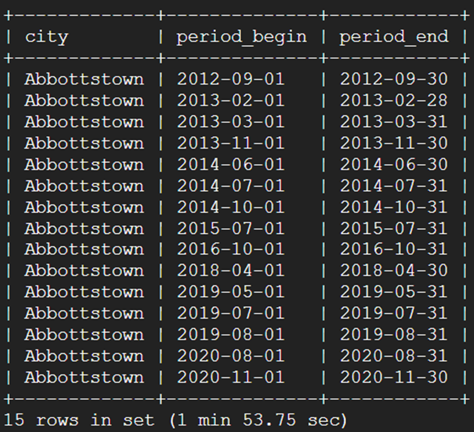
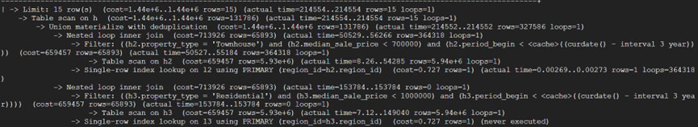
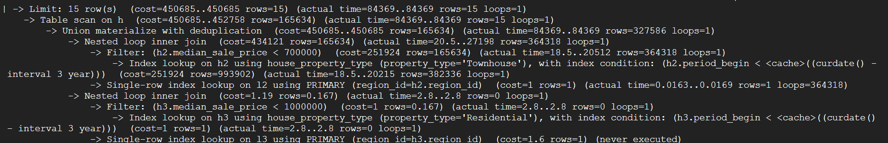
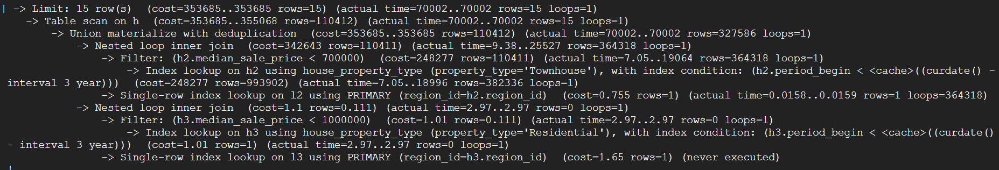

# First query
### Find the city, time_period for median_sale_price < 700k for townhouses and <1M for residential in the last 3 years
```SQL
SELECT h.city, h.period_begin, h.period_end
FROM (
    (
    SELECT l2.city, h2.period_begin, h2.period_end
    FROM Location l2 NATURAL JOIN House h2
    WHERE h2.median_sale_price < 700000 AND h2.property_type = 'Townhouse'
    )
UNION
(
    SELECT l3.city, h3.period_begin, h3.period_end
    FROM Location l3 NATURAL JOIN House h3
    WHERE h3.median_sale_price < 1000000 AND h3.property_type = 'Residential'
    
)
) AS h
WHERE h.period_begin < DATE_SUB(CURDATE(), INTERVAL 3 YEAR)
LIMIT 15; 
```
### top 15 rows


### explain analyze without index


### index house_median_sale_price


### index house_median_sale_price + house_property_type


### index house_property_type


# Second query

### Find the city and time period with the highest median price per square foot price in America
```SQL
SELECT House.period_begin, House.period_end, Location.city
FROM House NATURAL JOIN Location
WHERE House.median_ppsf =
    (
        SELECT MAX(h2.median_ppsf)
        FROM House h2
    );
```
### top 15 rows


### explain analyze without index


### index

### index

### index

# Third query
### Find highest price of house in a metro area over a time span for Townhouse
```SQL
SELECT MAX(House.median_sale_price), Location.parent_metro_region
FROM House NATURAL JOIN Location
WHERE House.property_type = 'Townhouse'
AND House.period_begin >= '2010-01-01' AND House.period_end < '2020-01-01'
GROUP BY Location.parent_metro_region
LIMIT 15;
```
### top 15 rows

### explain analyze without index

### index

### index

### index

# Fourth query
### Find number of user-reported houses favorited per state by user
```SQL
SELECT city, us_state, parent_metro_region, COUNT(User_Reporting.report_id)
FROM 
    User JOIN Favorites_Report
        ON User.user_id = Favorites_Report.favorite_user_id
    JOIN User_Reporting
        ON Favorites_Report.report_id = User_Reporting.report_id
        AND Favorites_Report.reporting_user_id = User_Reporting.user_id
WHERE User_Table.user_id = 'sh1'
GROUP BY Location.us_state
LIMIT 15;
```
### top 15 rows

### explain analyze without index

### index

### index

### index